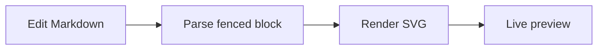

# Welcome to DiagramDown

DiagramDown is an offline macOS Markdown editor with first-class Mermaid and D2 diagrams. Edit this document to see the preview update beside the source.

## Markdown

- Write **bold**, *italic*, and `inline code`
- Use headings, lists, links, tables, and fenced code blocks
- Switch between Editor Only, Editor and Preview, and Preview Only from the toolbar
- Pinch on the trackpad or use the Preview menu to zoom

| Feature | Included |
| --- | --- |
| Native editor and line numbers | Yes |
| Bidirectional scroll sync | Yes |
| Light, dark, and system appearance | Yes |
| Offline diagram rendering | Yes |

```swift
let app = "DiagramDown"
print("Welcome to \(app)!")
```

## Mermaid



Hover over the diagram to open its focused viewer or export it as SVG.

## D2

```d2
direction: right
editor: Markdown editor
renderer: D2 renderer
preview: Live preview

editor -> renderer: source
renderer -> preview: SVG
```

D2 renders locally through the bundled helper. The last successful diagram stays visible while an edited replacement is rendering.

## Export

Use **Preview > Export Preview as PDF…** to export the complete rendered document.

Learn more or report a problem from the Help menu. Your documents remain local unless you choose to share them.
