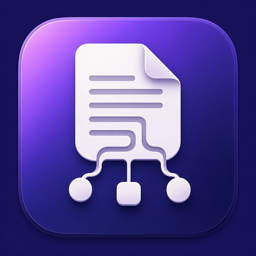

<p align="center">
  
</p>

<h1 align="center">DiagramDown</h1>

<p align="center">
  <strong>Markdown and diagrams, side by side.</strong>
</p>

<p align="center">
  A native macOS workspace for writing Markdown with live Mermaid and D2 diagrams.
  Fast, private, and fully offline.
</p>

<p align="center">
  <a href="https://github.com/Weichen-LF/DiagramDown/releases/latest"><strong>Download the latest release</strong></a>
  ·
  <a href="CHANGELOG.md">What’s new</a>
  ·
  <a href="https://github.com/Weichen-LF/DiagramDown/issues">Feedback</a>
</p>

<p align="center">
  <a href="https://github.com/Weichen-LF/DiagramDown/actions/workflows/ci.yml"></a>
  <a href="https://github.com/Weichen-LF/DiagramDown/actions/workflows/codeql.yml"></a>
  <a href="LICENSE"></a>
</p>

## Write ideas. Draw systems.

DiagramDown brings prose and diagrams into one focused workspace. Open a folder,
write naturally in Markdown, and see the finished document update beside you.
Mermaid and D2 fenced blocks become live diagrams without a browser, server, or
cloud account.

Everything needed for preview, diagrams, syntax highlighting, and formatting is
bundled with the app. Your documents stay on your Mac.

## Made for real Markdown projects

- **Workspace first** — open a folder, browse its tree, and keep multiple files in tabs.
- **Native editing** — macOS text input, line numbers, Undo, Find, smooth scrolling, and familiar shortcuts.
- **Live preview** — Markdown, Mermaid, D2, code highlighting, themes, and light/dark appearance.
- **Diagram friendly** — inspect diagrams in a focused viewer, pinch to zoom, and export SVG.
- **Stay in sync** — scroll either pane or click the preview to return to the matching source.
- **Pick up where you left off** — restore the last folder, tabs, layout, scroll position, and unsaved edits.
- **Finish the document** — format Markdown and embedded code, then export the complete preview as PDF.

Choose the layout that fits the moment: **Editor Only**, **Editor and Preview**,
or **Preview Only**.

## Get started

1. Download the Apple Silicon DMG from [GitHub Releases](https://github.com/Weichen-LF/DiagramDown/releases/latest).
2. Drag `DiagramDown.app` into the Applications shortcut.
3. Open a folder containing `.md` or `.markdown` files and start writing.

DiagramDown requires macOS 15 or later.

> [!IMPORTANT]
> The current community build is ad-hoc signed and is not notarized by Apple.
> On first launch, macOS may require **Open** from Finder’s context menu or
> **Open Anyway** in System Settings > Privacy & Security. Never disable
> Gatekeeper globally.

## Current release

DiagramDown `0.22.0` is an Apple Silicon release. It includes folder workspaces,
crash-safe session recovery, offline Mermaid and D2 rendering, bidirectional
scroll sync, formatting, themes, diagram SVG export, and full-preview PDF export.

Intel Macs, automatic updates, external-change conflict handling, and sidebar
file operations are not available yet.

<details>
<summary><strong>Build from source</strong></summary>

Requirements:

- macOS 15 or later
- Apple Silicon
- Xcode with the macOS SDK
- Node.js 18 or later for preview-runtime tests

Open `Mark.xcodeproj` and run the `Mark` scheme, or use:

```sh
xcodebuild \
  -project Mark.xcodeproj \
  -scheme Mark \
  -configuration Debug \
  -derivedDataPath /tmp/DiagramDownDerivedData \
  CODE_SIGNING_ALLOWED=NO \
  build
```

Run the complete test suite:

```sh
./Scripts/test.sh
```

Create the ad-hoc signed Apple Silicon DMG:

```sh
./Scripts/package-release.sh
```

See [the release guide](docs/release.md) for packaging and verification details.

</details>

## Project

- Read the [architecture and implementation plan](docs/swiftui-markdown-mermaid-d2-design.md).
- Explore the [folder workspace design](docs/workspace-folder-design.md).
- See [CONTRIBUTING.md](CONTRIBUTING.md) before proposing a change.
- Follow [SECURITY.md](SECURITY.md) for security-sensitive reports.

DiagramDown is open source under the [MIT License](LICENSE).
