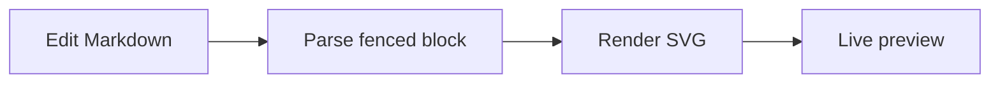

# DiagramDown release smoke test

This document combines the main Markdown, Mermaid, and D2 paths used by the first public release.

## Markdown

Edit this paragraph and confirm that the preview updates without replacing the WebView or losing the current scroll position.

- [ ] Native editor and line numbers
- [ ] Markdown preview
- [ ] Bidirectional scroll synchronization
- [ ] Light, dark, and system appearance
- [ ] Editor Only, Editor and Preview, and Preview Only layouts

| Feature | Expected result |
| --- | --- |
| **Bold** and *italic* | Styled text |
| `inline code` | Monospaced code |
| [Project repository](https://github.com/Weichen-LF/DiagramDown) | A clickable link |

```swift
let editor = "DiagramDown"
print(editor)
```

## Mermaid



Open the focused diagram viewer, test fit and manual zoom, use a trackpad pinch gesture if available, and export the diagram as SVG.

## D2

```d2
direction: right
editor: Markdown editor
preview: Live preview
renderer: D2 renderer

editor -> renderer: source
renderer -> preview: SVG
```

Edit a D2 label and confirm that the previous diagram remains visible until the replacement render is ready. Open the focused viewer and export the diagram as SVG.

## Export

Export the complete preview as PDF and confirm that Markdown and both diagrams are present. PNG and per-diagram PDF export are intentionally outside the current scope.
