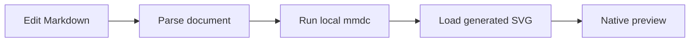
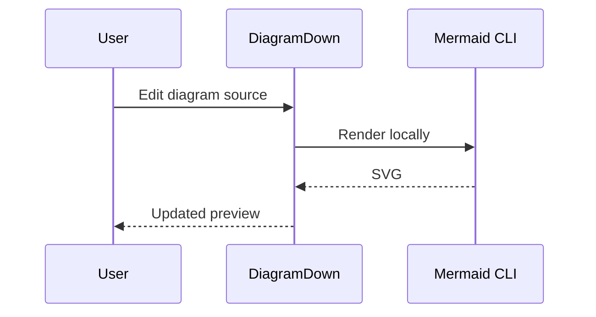

# DiagramDown all features

Open this document in DiagramDown to exercise the Markdown editor, native
preview, local images, syntax highlighting, Mermaid, D2, and export paths.

## Headings

### Level 3 heading

#### Level 4 heading

##### Level 5 heading

###### Level 6 heading

## Inline formatting

This paragraph contains **bold text**, *italic text*, ~~strikethrough~~,
`inline code`, and [a secure web link](https://github.com/Weichen-LF/DiagramDown).

Formatting can also be nested: ***bold italic*** and
**bold with `inline code` inside**.

This line ends with a Markdown line break.\
The next sentence should start on a new line.

Use the Edit > Markdown menu to insert or toggle the same constructs. The
standard shortcuts include Command-B for bold, Command-I for italic, and
Command-K for links.

## Block quotes

> DiagramDown renders Markdown with native SwiftUI views.
>
> Quotes can contain multiple paragraphs and **formatted text**.

## Lists

Unordered list:

- Native editor with line numbers
- Native preview
  - Light and dark appearance
  - Editor, split, and preview layouts
- PDF export

Ordered list:

1. Open a workspace folder.
2. Select a Markdown file.
3. Edit and preview it.

Task list:

- [x] Parse Markdown
- [x] Highlight supported code
- [ ] Edit this item and save the document

## Table

| Alignment | Example | Status |
| :--- | :---: | ---: |
| Left | `inline code` | 1 |
| Center | **bold** | 2 |
| Right | [link](https://example.com) | 3 |

---

## Local images

Relative image paths are resolved from the Markdown document. This example
loads a PNG stored elsewhere in the repository:


PNG, JPEG, GIF, WebP, and SVG files can also be referenced using an absolute
local path. Replace the example path below with a file on your Mac:

```markdown

```

An unavailable or unsupported image is shown as an image placeholder without
breaking the rest of the preview.

## Syntax highlighting

DiagramDown currently bundles Tree-sitter highlighting for Swift, Lua,
JavaScript/JSX, TypeScript/TSX, JSON, YAML, Bash, Dockerfile, Python, SQL, and
Go. Unknown language identifiers safely fall back to monospaced plain text.

### Dockerfile

```dockerfile
FROM swift:6.2
WORKDIR /workspace
COPY . .
RUN swift build -c release
CMD [".build/release/DiagramDown"]
```

### Python

```python
from dataclasses import dataclass

@dataclass
class Document:
    title: str
    dirty: bool = False

def display(document: Document) -> str:
    return f"{document.title}: {'edited' if document.dirty else 'saved'}"
```

### SQL

```sql
SELECT
    language,
    COUNT(*) AS example_count
FROM preview_examples
WHERE highlighted = TRUE
GROUP BY language
ORDER BY example_count DESC;
```

### Lua

```lua
local function render(document)
  if document.dirty then
    return "unsaved changes"
  end
  return "ready"
end

print(render({ dirty = false }))
```

### Go

```go
package main

import "fmt"

type Document struct {
	Title string
	Dirty bool
}

func main() {
	document := Document{Title: "DiagramDown"}
	fmt.Println(document.Title, document.Dirty)
}
```

### Swift

```swift
struct PreviewDocument {
    let title: String
    var isDirty = false
}

let document = PreviewDocument(title: "DiagramDown")
print(document.title)
```

### JSON and YAML

```json
{
  "name": "DiagramDown",
  "preview": "native",
  "diagramTools": ["mmdc", "d2"]
}
```

```yaml
name: DiagramDown
preview: native
diagram_tools:
  - mmdc
  - d2
```

### Plain-text fallback

```unsupported-language
This block remains readable even when no Tree-sitter grammar matches it.
```

## Mermaid

Mermaid blocks use the locally installed `mmdc` executable. If Mermaid CLI is
missing, DiagramDown displays the fenced source as a normal code block.





Use the diagram controls to open the focused viewer, fit the diagram, zoom
manually, and export the original SVG.

## D2

D2 blocks use the locally installed `d2` executable. If D2 is missing,
DiagramDown displays the fenced source as a normal code block.

```d2
direction: right

editor: Markdown editor
renderer: Local D2 CLI
preview: Native preview

editor -> renderer: source
renderer -> preview: SVG
```

```d2
workspace: Workspace {
  files: Markdown files
  recovery: Layout and tabs
}

external: External editor
external -> workspace.files: file change
workspace.files -> recovery: conflict detection
```

## Workspace behavior

Use this document together with the workspace UI to verify:

- creating files and folders from the sidebar
- renaming, moving, and deleting items
- Command-W closing the current file
- File > Open Recent reopening a workspace
- window size and sidebar width restoration after relaunch
- clean external edits reloading automatically
- dirty external edits showing Reload and Overwrite conflict actions

## Export checklist

1. Export the complete preview as PDF.
2. Confirm headings, lists, the table, local image, and code blocks are present.
3. When the local CLIs are installed, confirm Mermaid and D2 diagrams appear.
4. Open a successful diagram in the focused viewer and export its SVG.
