# Mermaid preview smoke test

This document exercises DiagramDown's local Mermaid rendering (`mmdr` by
default, or `mmdc` from Settings). Each section uses a common diagram type.

## Flowchart

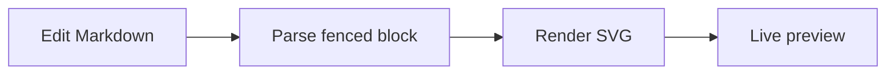

## Sequence diagram

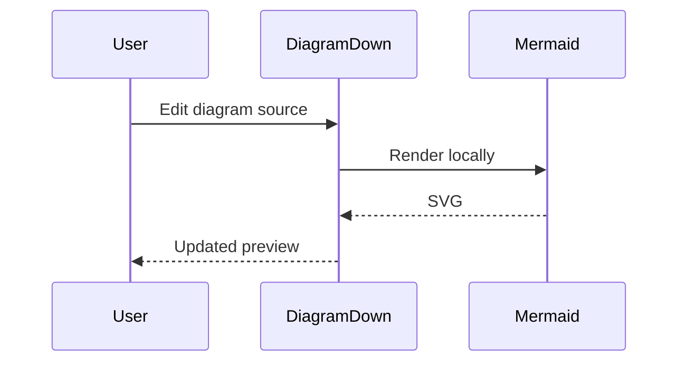

## Class diagram

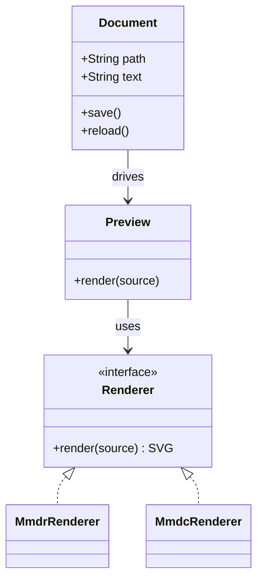

## State diagram

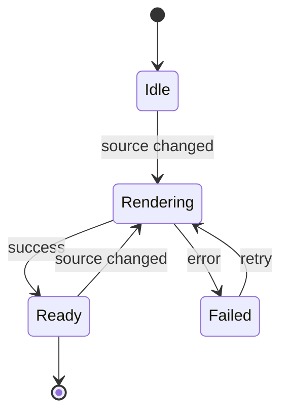

## Entity-relationship diagram

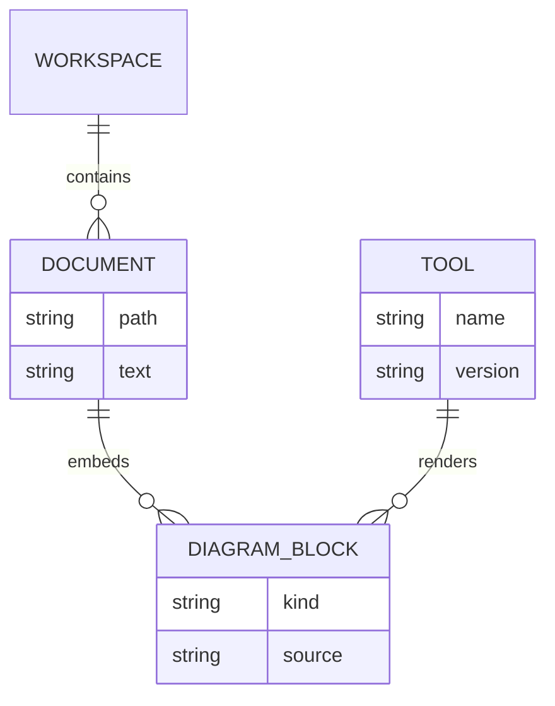

## Gantt chart

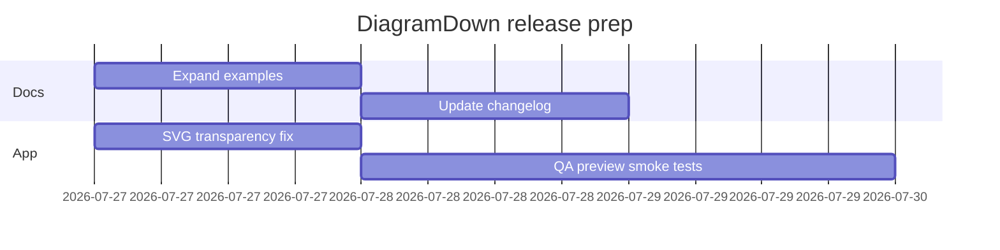

## Pie chart

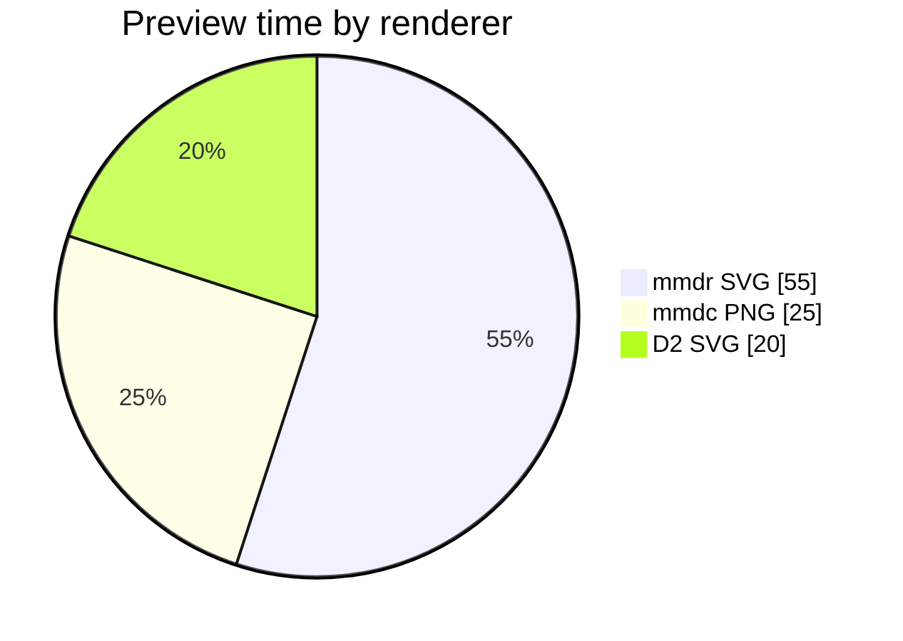

## User journey

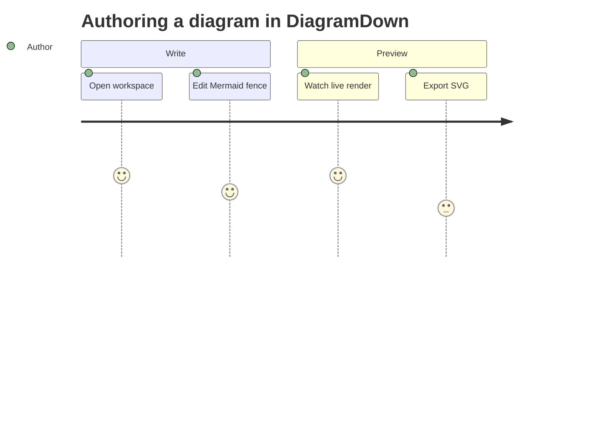

## Git graph

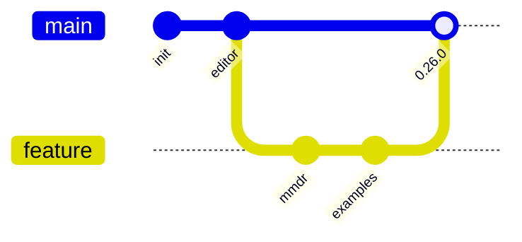

## Mind map

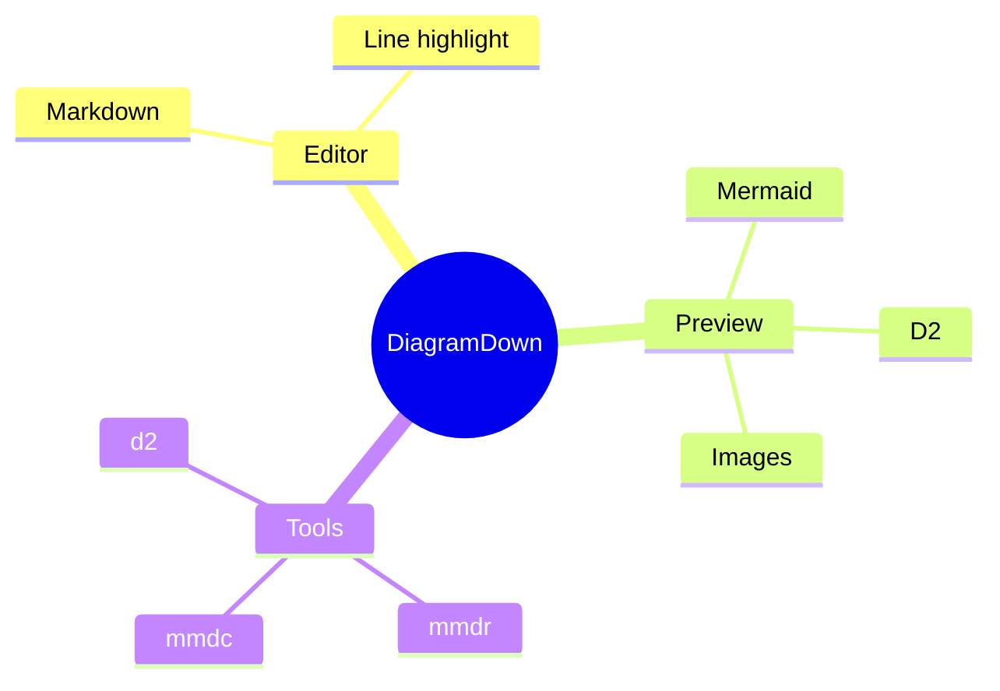

## Timeline

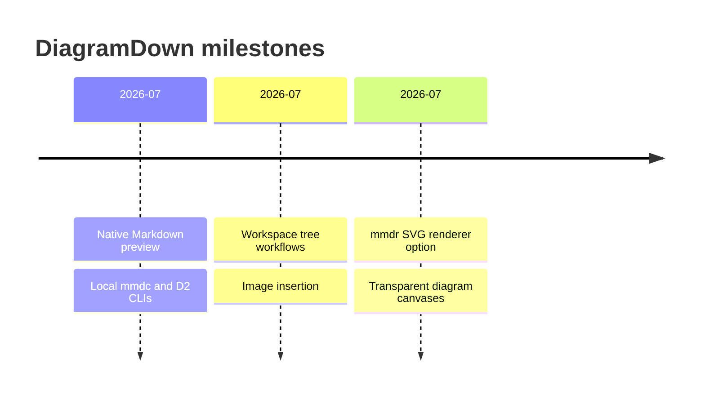

## Quadrant chart

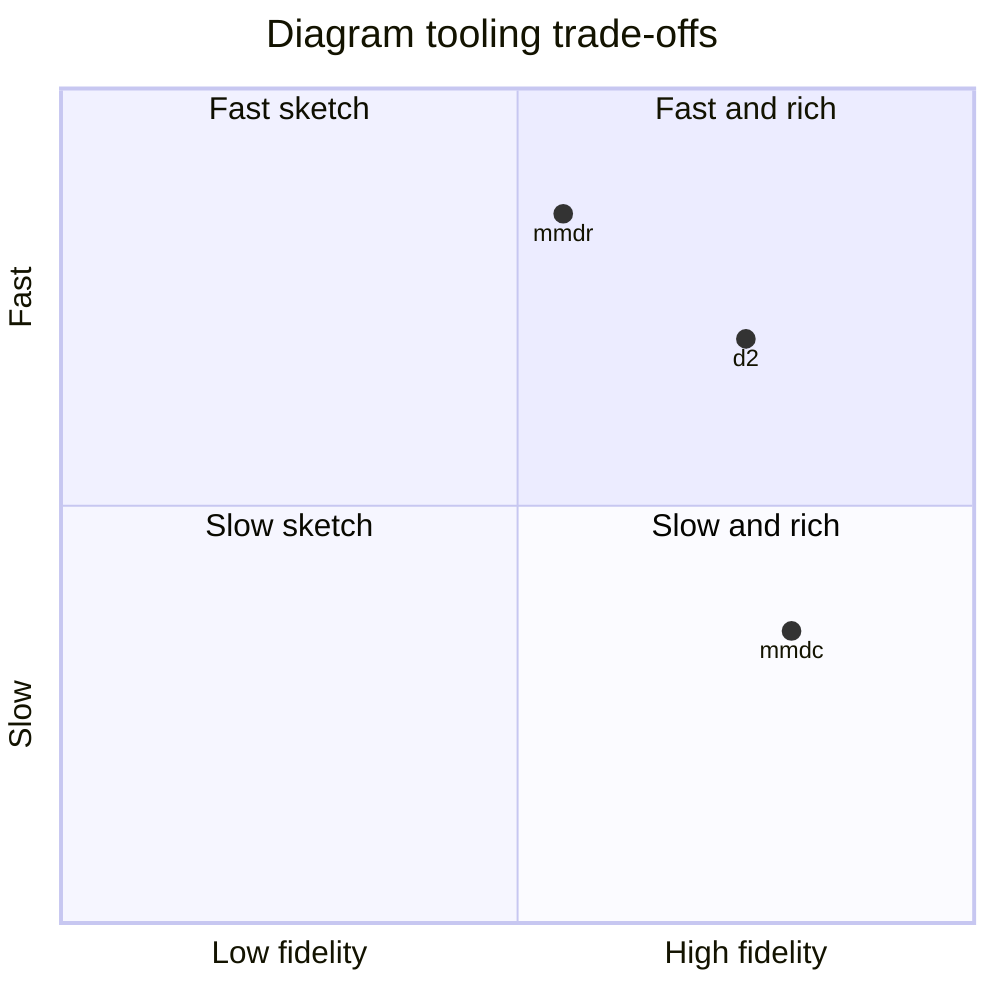

## XY chart

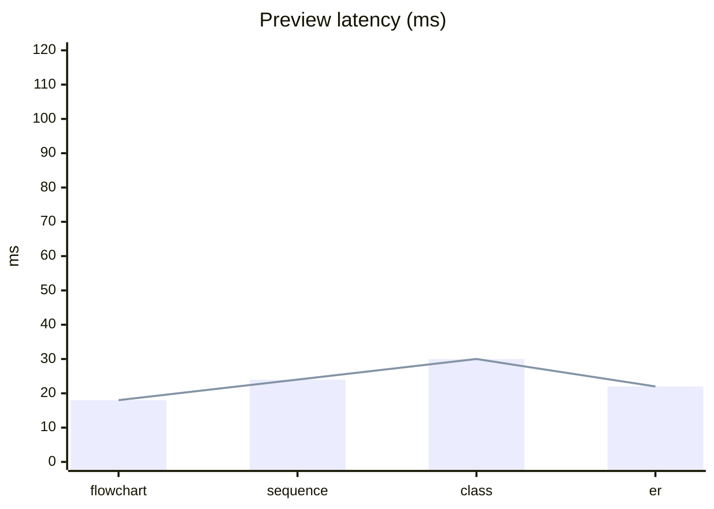

## C4 context

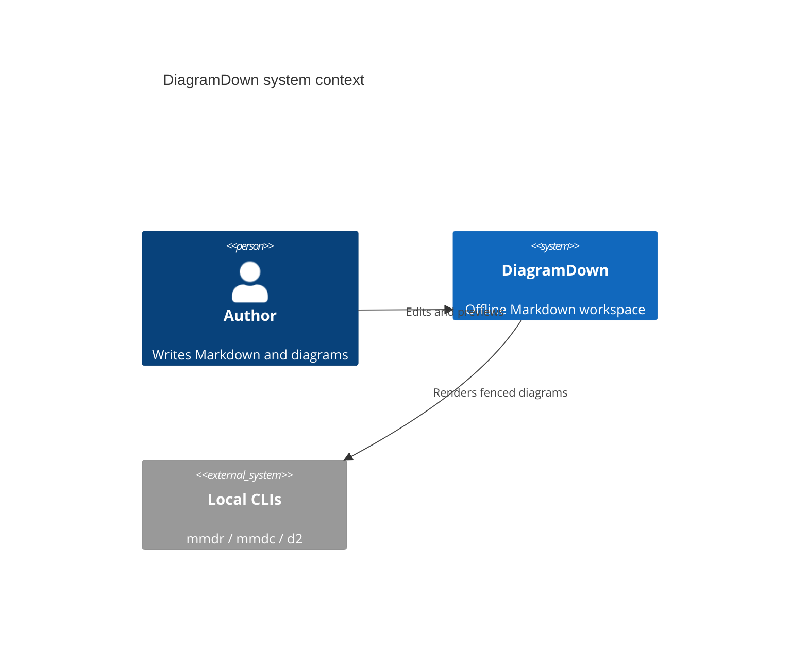

## Sankey

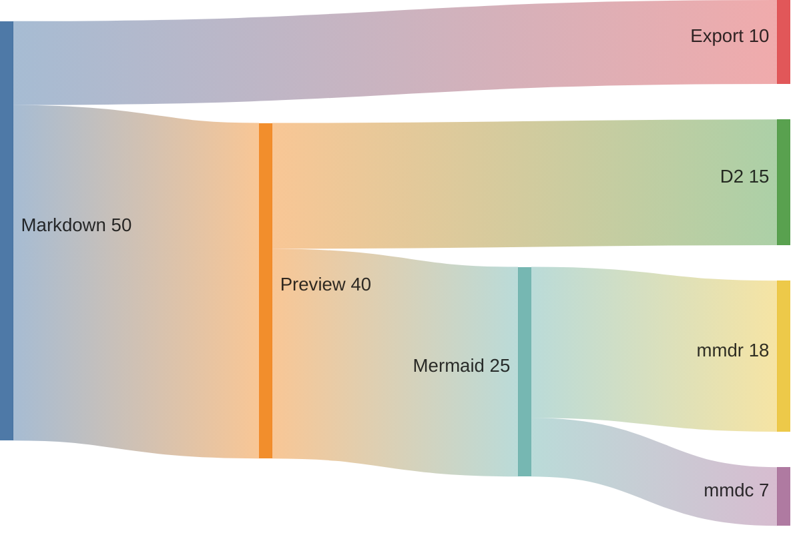

## Block diagram

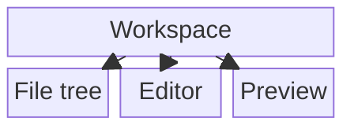

## Requirement diagram

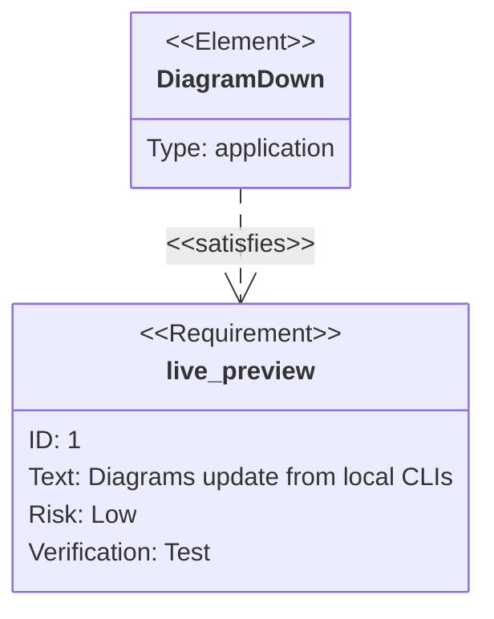

## Unicode labels

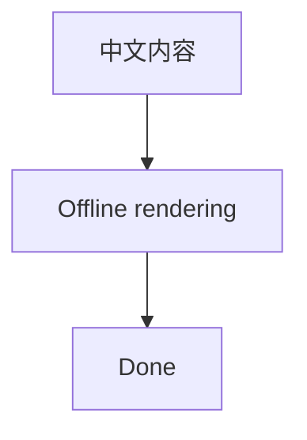
