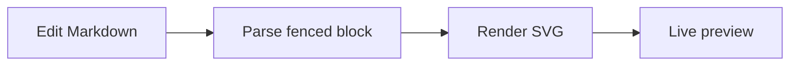
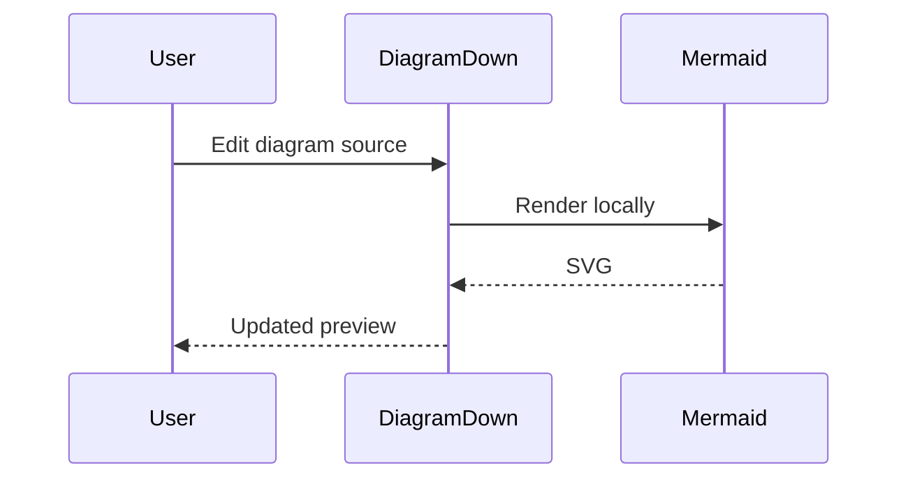
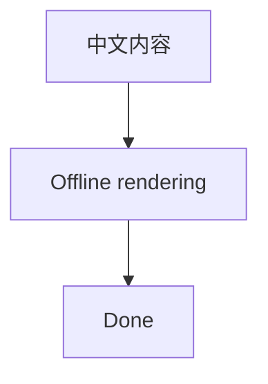

# Mermaid preview smoke test

This document exercises DiagramDown's bundled, offline Mermaid renderer.

## Flowchart

```mermaid
flowchart LR
    EDIT[Edit Markdown] --> PARSE[Parse fenced block]
    PARSE --> RENDER[Render SVG]
    RENDER --> PREVIEW[Live preview]
```

## Sequence diagram

```mermaid
sequenceDiagram
    participant U as User
    participant D as DiagramDown
    participant M as Mermaid
    U->>D: Edit diagram source
    D->>M: Render locally
    M-->>D: SVG
    D-->>U: Updated preview
```

## Unicode labels

```mermaid
flowchart TD
    A[中文内容] --> B[Offline rendering]
    B --> C[Done]
```
