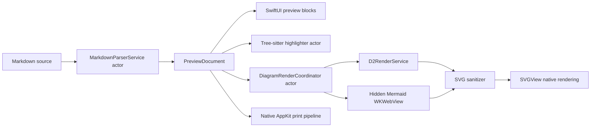

# DiagramDown native Markdown preview architecture

DiagramDown renders the visible Markdown preview entirely with SwiftUI. Markdown
source is parsed by `swift-markdown` into a small, Sendable `PreviewDocument`
model. The model carries source ranges and reconciled block IDs so edits can
update incrementally without losing scroll anchors or diagram state.

## Runtime flow

The editor and preview share `EditorPreviewSurface`, `ScrollSyncPosition`, and
the existing per-tab session state. The preview reports block geometry in
SwiftUI coordinates; editor-to-preview and preview-to-editor synchronization
interpolate between source-aware block anchors. Clicking a block selects its
first source line.

## Concurrency and stale-result policy

- Markdown parsing and block-ID reconciliation run in
  `MarkdownParserService`, outside the main actor.
- Tree-sitter parsing, capture normalization, and the bounded attributed-string
  cache run in `TreeSitterCodeHighlighter`.
- Mermaid, D2, and SVG sanitation run behind actors. SwiftUI only applies a
  result whose block ID and document revision still match the current request.
- The hidden Mermaid `WKWebView` is main-actor isolated. It receives source and
  configuration through `callAsyncJavaScript` arguments; it is not part of the
  visible view hierarchy.
- Native UI state and AppKit save/print panels remain on the main actor.

## Markdown and code

`swift-markdown` provides CommonMark plus the supported GFM nodes. The adapter
currently renders headings, paragraphs, emphasis, strong text, strikethrough,
links, images, block quotes, ordered and unordered lists, task lists, tables,
thematic breaks, code, Mermaid, and D2. Raw HTML is represented as text and is
never evaluated.

Tree-sitter grammars are pinned with SwiftPM. The first staged grammar batch is:

- Swift
- Lua
- JavaScript and JSX
- TypeScript and TSX
- JSON
- YAML
- Bash, shell, sh, and zsh

The language model already recognizes the later plan batches. Until their
grammar packages are added, those fences deliberately fall back to monospaced
plain text rather than JavaScript highlighting.

## Diagram and SVG boundary

D2 continues to use the sandboxed bundled helper through argument-based
`Process` invocation. Mermaid is the only WebKit component in the preview
pipeline. Its page has a restrictive CSP, a nonpersistent data store, no message
handlers, no network API, and navigation restricted to local files.

Both renderers return SVG text to the same coordinator. Before display or
export, `SVGSanitizer`:

- rejects DTDs, entities, malformed XML, invalid dimensions, oversized output,
  excessive depth, and excessive element counts;
- removes scripts, foreign objects, embedded browsing/media content, event
  attributes, JavaScript URLs, and external image references;
- permits only local fragment/data-image references plus allowlisted external
  links on anchor elements.

Sanitized SVGs use a bounded memory cache and a sharded, size-bounded disk cache.
`SVGView` renders the sanitized document natively. The same representation is
used by the focused diagram viewer and SVG export.

## Local resources and links

Preview links accept only `http`, `https`, and `mailto`. Remote images are
disabled. Embedded data images are size-limited. File images are standardized,
resolved through symlinks, size-checked, and required to stay inside the
security-scoped workspace root.

## Export

PDF export first resolves code highlighting and diagrams into an immutable
snapshot. A non-lazy SwiftUI print view is hosted in `NSHostingView` and written
through `NSPrintOperation`; no DOM or `WKWebView` PDF API is involved. Diagram
SVG export writes the already-sanitized SVG atomically.

## Dependencies and packaging

The project pins:

- `swift-markdown` 0.8.0
- `SVGView` 1.0.6
- `swift-tree-sitter` 0.25.0 and `tree-sitter` 0.25.10
- exact tags for every bundled grammar

License texts for these packages and their grammar bundles are copied into the
application resources. Release validation rejects legacy preview runtime files
and requires the Mermaid runtime, Tree-sitter queries, and new license set.

The old markdown-it/highlight.js page, DOM scroll bridge, visible `WKWebView`,
D2 Web bridge, and WebKit PDF/SVG export code have been removed.
