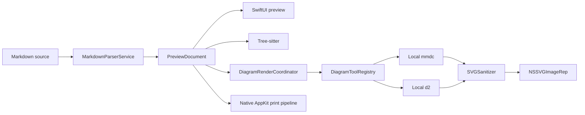

# DiagramDown native Markdown preview architecture

DiagramDown renders Markdown entirely with SwiftUI. Markdown source is parsed by
`swift-markdown` into a Sendable `PreviewDocument`; reconciled block IDs and
source ranges keep scrolling and asynchronous diagram results stable while the
document changes.

## Runtime flow

No application code uses WebKit. The bundled Markdown formatter runs the local
Prettier JavaScript assets in JavaScriptCore.

## Local diagram tools

DiagramDown does not bundle Mermaid or D2. `DiagramToolRegistry` discovers
`mmdc` and `d2` in this order:

1. a custom executable selected in Settings;
2. `/opt/homebrew/bin`;
3. `/usr/local/bin`;
4. directories inherited from the application `PATH`.

Candidates are validated with `mmdc --version` or `d2 version`. The resolved
absolute path and reported version are part of the render cache key. Settings
can refresh detection, select a custom executable, restore automatic detection,
and copy Homebrew installation commands.

Commands are launched directly with an absolute executable and argument array;
document content is never interpolated into a shell command. Each render uses a
private temporary directory, bounded input/output and diagnostics, a timeout,
cancellation, and process-group cleanup.

Mermaid receives the active theme and produces a transparent SVG. D2 receives
exactly one theme ID for the effective light or dark appearance, avoiding
dual-theme CSS in its output.

## Fallback and error policy

- If the required CLI is missing or invalid, the fenced source is rendered as a
  normal code block with a link to Diagram Tools settings.
- If an installed CLI fails, times out, or produces invalid output, preview
  shows a bounded error card without stale SVG or source.
- PDF export mirrors this behavior: unavailable tools become source code and
  render failures become diagnostic placeholders rather than failing the whole
  export.
- SVG view/export controls appear only after a successful render.

## Concurrency, cache, and SVG boundary

Parsing, Tree-sitter highlighting, CLI execution, and SVG sanitation run behind
actors. SwiftUI only applies a result whose block ID and document revision match
the active request.

Sanitized SVGs use bounded memory and disk caches. `SVGSanitizer` rejects DTDs,
entities, malformed XML, invalid dimensions, excessive size/depth/elements,
scripts, foreign objects, event attributes, JavaScript URLs, and external image
references. The same sanitized document is displayed with macOS
`NSImage`/`NSSVGImageRep`, exported as SVG, and used by native PDF printing.

## Packaging

The application is distributed directly, with Hardened Runtime and optional
Developer ID signing/notarization. App Sandbox is intentionally disabled so the
application can execute user-installed Node/Puppeteer and D2 toolchains. Release
validation rejects WebKit linkage, bundled Mermaid/D2 runtimes, SVGView, and
obsolete sandbox/network entitlements.

Pinned application dependencies are `swift-markdown`, `swift-tree-sitter`, and
the Tree-sitter grammar packages. Mermaid and D2 versions are controlled by the
user's local installations.
