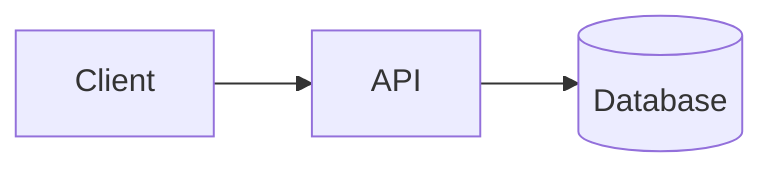
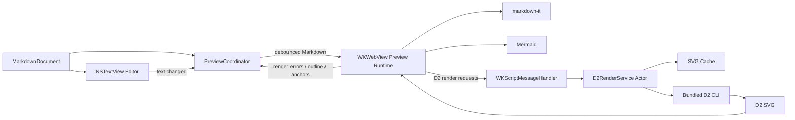

# macOS Markdown 编辑与预览工具技术方案

> [!WARNING]
> 本文记录的是 `0.22.0` 及更早版本的 Web 预览架构，已被
> [原生 Markdown 预览架构](native-markdown-preview-architecture.md) 取代。
> 当前实现使用 SwiftUI 原生预览和用户本机的 `mmdc`/`d2`，不再使用
> markdown-it、highlight.js、内置图表运行时或任何 `WKWebView`。

> `0.22.0` 架构更新：DiagramDown 现在只使用文件夹工作区 Scene。下文中关于
> `DocumentGroup`、`MarkdownDocument`、`ContentView`、Finder 单文件打开和
> 未命名单文件窗口的内容属于早期 MVP 架构，现已由 `WorkspaceSceneView`、
> `WorkspaceSession` 和 `OpenFileBuffer` 取代。

## 1. 方案结论

采用以下组合：

- **开发语言**：Swift
- **应用框架**：SwiftUI
- **文本编辑器**：AppKit `NSTextView`，通过 `NSViewRepresentable` 嵌入 SwiftUI
- **Markdown 预览**：`WKWebView`
- **Markdown HTML 渲染**：随应用打包的 `markdown-it` JavaScript
- **Mermaid 渲染**：随应用打包的 Mermaid 单文件浏览器运行时，直接在 `WKWebView` 中生成 SVG
- **D2 渲染**：随应用打包的 D2 原生 CLI，由 Swift `Process` 启动并生成 SVG
- **文档模型**：SwiftUI `DocumentGroup` + `FileDocument`
- **并发模型**：Swift Concurrency；D2 渲染服务使用 `actor`
- **缓存**：内存缓存 + `Library/Caches` 磁盘缓存

这套架构的核心原则是：

1. 编辑界面保持原生，保证输入法、撤销、选择、滚动和大文本编辑体验。
2. 预览统一使用 WebKit，避免分别实现 Markdown、CSS、SVG、Mermaid 的原生渲染器。
3. Mermaid 不启动外部进程；D2 使用单独的原生 CLI，不依赖 Go runtime、Node.js 或 JVM。
4. 应用启动时先显示编辑器，预览引擎延迟初始化，降低首屏延迟。

---

## 2. 产品范围

### 2.1 MVP 功能

- 打开、创建、编辑和保存 `.md`、`.markdown` 文件
- 左侧 Markdown 编辑、右侧实时预览
- 支持标准 Markdown：
  - 标题
  - 段落
  - 引用
  - 有序和无序列表
  - 表格
  - 链接
  - 图片
  - 行内代码和代码块
  - GitHub Flavored Markdown 常用扩展
- 支持 Mermaid fenced code block
- 支持 D2 fenced code block
- 深色和浅色主题
- 编辑区与预览区滚动位置基本同步
- Mermaid、D2 错误在预览中就地显示
- 自动保存和窗口状态恢复

### 2.2 暂不实现

- 所见即所得编辑
- PlantUML
- 自由拖拽修改图形
- Markdown 项目/知识库管理
- 插件系统
- iCloud 协作
- 多人实时编辑
- App Store 首发

---

## 3. Markdown 文件约定

Mermaid：

````markdown

````

D2：

````markdown
```d2
client -> api -> database
```
````

D2 可选配置建议放在代码块属性或应用级设置中。MVP 不建议发明复杂语法，先提供全局设置：

- Layout：`dagre` / `elk`
- Theme
- Padding
- Sketch mode
- Dark theme mapping

后续可以支持：

````markdown
```d2 layout=elk theme=200
client -> api -> database
```
````

---

## 4. 总体架构



---

## 5. UI 架构

### 5.1 SwiftUI 负责应用外壳

SwiftUI 负责：

- `App`
- `DocumentGroup`
- 菜单和快捷键
- 工具栏
- 分栏布局
- 设置窗口
- 状态栏
- 主题和偏好设置

主窗口建议使用 `HSplitView`：

```swift
struct DocumentView: View {
    @Binding var document: MarkdownDocument
    @State private var previewVisible = true

    var body: some View {
        HSplitView {
            MarkdownEditorView(text: $document.text)
                .frame(minWidth: 320)

            if previewVisible {
                MarkdownPreviewView(markdown: document.text)
                    .frame(minWidth: 320)
            }
        }
    }
}
```

### 5.2 编辑器使用 `NSTextView`

不建议把 SwiftUI `TextEditor` 作为正式编辑器核心。使用 `NSTextView` 可以直接获得：

- macOS 原生输入法和候选窗口行为
- Undo/Redo
- 拼写检查
- 光标和选区
- Find/Replace
- Services
- 拖放
- Accessibility
- 大文本滚动

包装层：

```text
MarkdownEditorView: NSViewRepresentable
└── NSScrollView
    └── NSTextView
        └── NSTextStorage
```

编辑器更新必须避免 SwiftUI 状态和 `NSTextView` 互相重复写入：

```swift
final class Coordinator: NSObject, NSTextViewDelegate {
    var parent: MarkdownEditorView
    var isApplyingExternalChange = false

    func textDidChange(_ notification: Notification) {
        guard !isApplyingExternalChange,
              let textView = notification.object as? NSTextView else {
            return
        }
        parent.text = textView.string
    }
}
```

### 5.3 预览使用单个长期存活的 `WKWebView`

不要在每次文本变化时重新创建 `WKWebView` 或重新加载整张 HTML 页面。

正确方式：

1. 初始化时加载一次本地 `preview.html`。
2. 后续通过 JavaScript API 传入 Markdown 文本。
3. 页面内部更新 DOM。
4. Mermaid 和 D2 只更新变化的图块。

这样可以避免：

- WebKit 重复启动
- 页面闪烁
- 预览滚动位置丢失
- Mermaid 反复初始化
- JavaScript 资源重复解析

---

## 6. Preview Runtime 设计

应用资源：

```text
Resources/Preview/
├── preview.html
├── preview.css
├── preview.js
├── markdown-it.min.js
├── mermaid.min.js
└── code-theme.css
```

### 6.1 JavaScript 对外接口

`preview.js` 暴露：

```javascript
window.previewRuntime = {
  renderMarkdown(markdown, revision, options),
  applyD2Result(blockID, revision, svg),
  applyD2Error(blockID, revision, error),
  setTheme(theme),
  scrollToSourceLine(line)
};
```

Swift 通过参数化 JavaScript 调用传递数据，不要把 Markdown 直接拼接进 JavaScript 字符串。

### 6.2 Markdown 渲染

使用 `markdown-it` 自定义 fence renderer：

- 普通代码块：输出带语言 class 的 `<pre><code>`
- `mermaid`：输出 Mermaid placeholder
- `d2`：输出 D2 placeholder，同时登记 D2 请求

伪代码：

```javascript
const defaultFence = md.renderer.rules.fence;

md.renderer.rules.fence = (tokens, index, options, env, self) => {
  const token = tokens[index];
  const language = token.info.trim().split(/\s+/)[0];
  const source = token.content;
  const blockID = stableBlockID(language, source, index);

  if (language === "mermaid") {
    return `<div class="diagram mermaid-diagram"
                 data-block-id="${blockID}"></div>`;
  }

  if (language === "d2") {
    env.d2Blocks.push({ id: blockID, source });
    return `<div id="diagram-${blockID}"
                 class="diagram d2-diagram pending">Rendering D2…</div>`;
  }

  return defaultFence(tokens, index, options, env, self);
};
```

### 6.3 Mermaid 渲染

Mermaid 在本地页面中初始化一次：

```javascript
mermaid.initialize({
  startOnLoad: false,
  securityLevel: "strict",
  theme: currentTheme,
  flowchart: {
    htmlLabels: false
  }
});
```

每次 Markdown DOM 更新后：

1. 找到 Mermaid placeholder。
2. 调用 `mermaid.render(blockID, source)`。
3. 将返回的 SVG 放入对应容器。
4. 捕获异常并显示源代码行和错误信息。

不要依赖 CDN。Mermaid 文件随应用固定版本打包，以保证：

- 离线工作
- 渲染结果可复现
- 不受网络和 CDN 更新影响
- 不泄露文档内容

---

## 7. D2 CLI 集成

### 7.1 打包方式

建议将 D2 可执行文件放到应用 bundle 的 helper/tool 目录，并作为嵌套可执行代码签名。

MVP 可以仅支持 Apple Silicon：

```text
MyMarkdown.app/
└── Contents/
    ├── MacOS/MyMarkdown
    ├── Helpers/d2
    └── Resources/Preview/...
```

后续若提供 Intel 版本：

- 分别构建 `arm64` 与 `x86_64` D2
- 发布两个 App 构建，或制作经过验证的 Universal 构建
- 缓存 key 必须包含 CPU 架构和 D2 版本

### 7.2 不调用 shell

禁止：

```swift
Process.launchPath = "/bin/zsh"
arguments = ["-c", "d2 \(userInput) ..."]
```

必须直接启动固定路径的 D2 executable：

```swift
process.executableURL = d2ExecutableURL
process.arguments = [inputURL.path, outputURL.path]
```

这可以避免 shell injection，也避免用户文本被解释为命令。

### 7.3 D2RenderService

```swift
actor D2RenderService {
    private let executableURL: URL
    private let cache: DiagramCache

    init(executableURL: URL, cache: DiagramCache) {
        self.executableURL = executableURL
        self.cache = cache
    }

    func render(
        source: String,
        configuration: D2RenderConfiguration
    ) async throws -> String {
        let key = configuration.cacheKey(source: source)

        if let cached = await cache.svg(for: key) {
            return cached
        }

        let svg = try await runD2(
            source: source,
            configuration: configuration
        )

        try await cache.store(svg: svg, for: key)
        return svg
    }
}
```

配置模型：

```swift
struct D2RenderConfiguration: Hashable, Codable, Sendable {
    enum Layout: String, Codable, Sendable {
        case dagre
        case elk
    }

    var layout: Layout
    var themeID: Int?
    var padding: Int
    var sketch: Bool
    var darkMode: Bool
    var d2Version: String
}
```

### 7.4 CLI 执行流程

```text
D2 source
  ↓
创建唯一临时目录
  ↓
写入 input.d2
  ↓
启动 bundled d2 input.d2 output.svg
  ↓
同时读取 stdout/stderr，防止 pipe 阻塞
  ↓
检查退出码、超时和输出大小
  ↓
读取 output.svg
  ↓
清理临时目录
  ↓
写入缓存
```

推荐每个任务使用独立目录：

```text
/tmp/<bundle-id>/<UUID>/
├── input.d2
└── output.svg
```

不要使用固定的 `/tmp/input.d2`，否则并发渲染会互相覆盖。

### 7.5 超时和取消

建议约束：

- 单个 D2 源码最大 256 KB
- 默认超时 5 秒
- SVG 最大 8 MB
- 同时最多运行 2 个 D2 进程
- 文档出现新 revision 时，取消尚未开始的旧任务
- 已运行进程在取消后调用 `terminate()`
- 退出后仍未结束时再强制终止

任务必须带 revision：

```swift
struct DiagramRequest: Sendable {
    let documentID: UUID
    let revision: UInt64
    let blockID: String
    let source: String
}
```

D2 完成后，如果结果 revision 不是当前 revision，直接丢弃，防止旧结果覆盖新内容。

---

## 8. 渲染协调器

`PreviewCoordinator` 负责：

- 文本变化 debounce
- 文档 revision
- Mermaid/Markdown WebView 更新
- D2 请求去重
- D2 并发和取消
- 结果注入
- 预览滚动位置

建议流程：

```text
NSTextView textDidChange
    ↓
更新 MarkdownDocument.text
    ↓
PreviewCoordinator 收到新文本
    ↓
150 ms debounce
    ↓
revision += 1
    ↓
调用 previewRuntime.renderMarkdown
    ↓
WebView 立即显示普通 Markdown 和 diagram placeholders
    ↓
Mermaid 在 WebView 内异步渲染
    ↓
WebView 把 D2 blocks 发给 Swift
    ↓
D2RenderService 查询缓存/启动 CLI
    ↓
Swift 把 SVG 或 error 返回 WebView
```

### 8.1 为什么 D2 请求由 WebView 产生

因为 Markdown fence 的最终解释规则已经在 `markdown-it` 中执行。这样可以避免 Swift 和 JavaScript 各自解析 Markdown，导致二者对以下情况认知不一致：

- 缩进代码块
- fence 长度
- fence 内反引号
- language info string
- 未闭合代码块

Swift 只负责执行 D2，不负责理解 Markdown 语法。

---

## 9. 缓存设计

缓存 key：

```text
SHA256(
  d2Source
  + d2Version
  + layout
  + theme
  + padding
  + sketch
  + darkMode
)
```

两级缓存：

### 9.1 内存缓存

- 使用 `NSCache<NSString, NSString>`
- 保存当前窗口最常使用的 SVG
- 设置总成本限制，例如 32 MB

### 9.2 磁盘缓存

```text
~/Library/Caches/<bundle-id>/d2/
└── ab/cd/<hash>.svg
```

策略：

- 最大 256 MB
- 使用文件修改时间记录最近访问，LRU 清理到 224 MB，避免临界点反复清理
- 原子写入，读取时校验文件类型、大小、UTF-8 和 SVG 边界
- 损坏或不可信的缓存条目会被移除并重新渲染
- D2 升级后自然产生新 key
- 缓存失败不影响正常渲染

---

## 10. 安全设计

### 10.1 WebView

预览页面完全本地化，并设置严格 CSP：

```html
<meta http-equiv="Content-Security-Policy"
      content="default-src 'none';
               script-src 'self';
               style-src 'self' 'unsafe-inline';
               img-src 'self' data: app-resource:;
               font-src 'self';">
```

建议：

- 使用非持久化 `WKWebsiteDataStore`
- 禁止任意页面导航
- 外部链接交给 `NSWorkspace` 打开
- 不允许远程脚本
- Mermaid 使用 `securityLevel: strict`
- Markdown 原始 HTML 默认关闭或经过严格消毒
- 禁止预览页面访问任意本地文件

### 10.2 D2

- 只允许启动 bundle 内固定路径的 D2
- 不调用 shell
- 参数数组固定构造
- 限制输入、输出大小和执行时间
- 临时目录使用系统 API 创建
- 所有文件名由应用生成，不使用用户输入作为路径
- D2 进程继承应用沙箱权限，不额外扩权

D2 SVG 可能包含链接、图片或其他引用。即使 SVG 来自本地 D2，也应由 CSP 阻断任意外部资源，必要时在注入前清理：

- `<script>`
- event handler attributes
- `javascript:` URL
- 非允许协议的 `href` / `xlink:href`
- 外部 `<image>` 引用

---

## 11. 文件与图片处理

Markdown 相对图片路径需要以当前文档所在目录为基准：

```markdown

```

不要把目录路径直接暴露给 WebView。建议注册自定义 URL scheme：

```text
app-resource://document/<token>/images/architecture.png
```

由 `WKURLSchemeHandler`：

1. 校验 token 对应当前文档。
2. 标准化路径。
3. 拒绝 `..` 越界访问。
4. 读取 sandbox 已授权范围内的文件。
5. 返回正确 MIME type。

D2 中若需要引用本地图片，D2 进程必须获得相应文件。MVP 可以先不支持 D2 外部图片；后续可以把允许的资源复制到临时工作目录再渲染。

---

## 12. 滚动同步

完全精确的双向滚动同步成本较高。MVP 使用“源码块锚点 + 比例回退”：

1. Markdown renderer 为 block token 输出 `data-source-line`。
2. 编辑器滚动时获得顶部可见字符位置。
3. 将字符位置换算成行号。
4. WebView 查找最近的 `data-source-line` 并滚动。
5. 找不到锚点时使用滚动比例。

预览到编辑器的反向同步可通过点击预览元素实现：

```javascript
document.addEventListener("click", event => {
  const element = event.target.closest("[data-source-line]");
  if (element) {
    window.webkit.messageHandlers.sourceNavigation.postMessage({
      line: Number(element.dataset.sourceLine)
    });
  }
});
```

---

## 13. 错误展示

### 13.1 Mermaid

在原 diagram block 位置显示：

```text
Mermaid rendering failed
Line 4: Unexpected token

[Show source]
```

### 13.2 D2

D2 CLI 非零退出时：

- 捕获 stderr
- 显示 block 序号
- 尝试解析行列号
- 保留最后一个成功 SVG，顶部叠加“当前源码渲染失败”提示，避免图形突然消失

错误结果也可以短期缓存，例如 1 秒，避免用户停留在同一错误状态时不断启动进程。

---

## 14. 项目目录建议

```text
MyMarkdown/
├── App/
│   ├── MyMarkdownApp.swift
│   ├── AppCommands.swift
│   └── AppSettings.swift
├── Document/
│   ├── MarkdownDocument.swift
│   └── DocumentMetadata.swift
├── Editor/
│   ├── MarkdownEditorView.swift
│   ├── MarkdownTextView.swift
│   ├── EditorCoordinator.swift
│   └── SyntaxHighlighter.swift
├── Preview/
│   ├── MarkdownPreviewView.swift
│   ├── PreviewWebView.swift
│   ├── PreviewCoordinator.swift
│   ├── PreviewMessageHandler.swift
│   └── PreviewTheme.swift
├── Diagram/
│   ├── DiagramRequest.swift
│   ├── DiagramCache.swift
│   ├── D2RenderService.swift
│   ├── D2ProcessRunner.swift
│   └── SVGSanitizer.swift
├── Resources/
│   ├── Preview/
│   │   ├── preview.html
│   │   ├── preview.css
│   │   ├── preview.js
│   │   ├── markdown-it.min.js
│   │   └── mermaid.min.js
│   └── Licenses/
│       ├── Mermaid-LICENSE.txt
│       ├── D2-LICENSE.txt
│       └── MarkdownIt-LICENSE.txt
├── Helpers/
│   └── d2
└── Tests/
    ├── DocumentTests/
    ├── PreviewTests/
    ├── D2RenderTests/
    ├── SecurityTests/
    └── SnapshotTests/
```

---

## 15. 核心协议

```swift
protocol DiagramRendering: Sendable {
    func render(
        source: String,
        configuration: D2RenderConfiguration
    ) async throws -> DiagramRenderResult
}

struct DiagramRenderResult: Sendable {
    let svg: String
    let duration: Duration
    let cacheHit: Bool
}

enum DiagramRenderError: LocalizedError, Sendable {
    case executableMissing
    case inputTooLarge
    case timedOut
    case cancelled
    case processFailed(exitCode: Int32, stderr: String)
    case outputMissing
    case outputTooLarge
    case invalidSVG
}
```

`Process` 本身不是 `Sendable`。应将它封装在 actor 内，不要跨 actor 传递。

---

## 16. D2 Process Runner 伪代码

```swift
actor D2ProcessRunner {
    private var running: [UUID: Process] = [:]

    func run(
        executableURL: URL,
        source: String,
        configuration: D2RenderConfiguration
    ) async throws -> String {
        let jobID = UUID()
        let directory = try FileManager.default.createUniqueTemporaryDirectory()
        defer { try? FileManager.default.removeItem(at: directory) }

        let inputURL = directory.appendingPathComponent("input.d2")
        let outputURL = directory.appendingPathComponent("output.svg")
        try source.write(to: inputURL, atomically: true, encoding: .utf8)

        let process = Process()
        let stderrPipe = Pipe()
        let stdoutPipe = Pipe()

        process.executableURL = executableURL
        process.currentDirectoryURL = directory
        process.arguments = buildArguments(
            inputURL: inputURL,
            outputURL: outputURL,
            configuration: configuration
        )
        process.standardError = stderrPipe
        process.standardOutput = stdoutPipe

        running[jobID] = process
        defer { running.removeValue(forKey: jobID) }

        try process.run()

        return try await withTaskCancellationHandler {
            try await waitForExitWithTimeout(
                process: process,
                stderrPipe: stderrPipe,
                outputURL: outputURL,
                timeout: .seconds(5)
            )
        } onCancel: {
            Task { await self.terminate(jobID: jobID) }
        }
    }
}
```

实际实现必须并发读取 stdout/stderr；不能等进程结束后才开始读取，否则大量输出可能填满 pipe 并导致子进程阻塞。

---

## 17. 性能策略

### 17.1 启动

- 应用首屏仅初始化 SwiftUI 和 `NSTextView`
- `WKWebView` 在窗口出现后异步创建，或仅在预览面板可见时创建
- 不在启动阶段执行 D2
- 不扫描整个磁盘缓存
- Mermaid 与 Markdown JS 仅加载本地压缩文件

### 17.2 编辑期间

- Markdown 更新 debounce：约 120–200 ms
- D2 更新 debounce：约 250–400 ms
- Mermaid 在 WebView 中异步执行
- D2 仅重绘内容 hash 变化的 block
- 旧 revision 结果不得覆盖新 revision
- 大文档可只渲染可视区域附近的 diagrams，作为后续优化

### 17.3 WebView DOM

MVP 可以替换完整 preview body；优化阶段再做 block-level DOM diff。

优先保证：

- 一个长期存活的 WebView
- 资源不重复加载
- 保留滚动锚点
- Diagram block 使用稳定 ID

通常已经足够流畅。

---

## 18. 测试策略

### 18.1 单元测试

- D2 参数构造
- cache key 稳定性
- 临时目录隔离
- revision 丢弃逻辑
- 输入和输出大小限制
- SVG sanitizer
- 文档编码与换行符

### 18.2 集成测试

使用固定 D2 输入生成 SVG，验证：

- exit code 为 0
- SVG 可解析
- 关键文本存在
- 同样输入命中缓存
- syntax error 返回行号和 stderr
- 超时可以终止进程

### 18.3 Snapshot 测试

保存代表性 Markdown：

- 普通 Markdown
- 多个 Mermaid
- 多个 D2
- Mermaid 与 D2 混合
- 深色主题
- Unicode、中文和 emoji
- 超宽图
- 大型图

SVG 不适合直接按完整字符串比较，因为版本升级可能改变无意义属性。应规范化后比较，或生成位图进行视觉 snapshot。

---

## 19. 分阶段开发计划

### Phase 1：原生 Markdown 编辑器

- `DocumentGroup`
- `FileDocument`
- `NSTextView`
- 打开、保存、自动保存
- 分栏 UI

预计工作重点：文档生命周期和编辑器状态同步。

### Phase 2：Markdown WebView 预览

- 本地 `preview.html`
- markdown-it
- CSS 主题
- 链接、图片、代码块
- debounce

### Phase 3：Mermaid

- 本地打包 Mermaid
- custom fence renderer
- SVG 渲染
- 错误展示
- 深色主题

### Phase 4：D2 CLI

- 打包和签名 D2
- `D2RenderService`
- 临时目录
- 超时、取消和错误处理
- SVG 注入

### Phase 5：缓存与体验优化

- 内存/磁盘缓存
- 稳定 block ID
- revision 管理
- 滚动同步
- Editor Only / Editor and Preview / Preview Only 三种窗口布局
- 50%–200% 持久化预览缩放
- Mermaid/D2 单图聚焦预览，支持适应窗口和 25%–400% 独立缩放
- Markdown 预览和单图聚焦预览均支持触控板双指缩放
- Mermaid/D2 单图 SVG 导出
- 整篇 Markdown 预览分页导出 PDF

当前导出范围不包含 PNG，也不包含单个图表的 PDF 导出。

### Phase 6：发布准备

- Swift 单元测试和 Web 预览运行时结构测试（已完成）
- Hardened Runtime（主应用和 D2 helper 均已纳入发布校验）
- App Sandbox 验证（已完成自动校验）
- ad-hoc 签名 Apple Silicon Community Release 与 SHA-256 校验（已完成；公开发布时必须醒目标注未经 Apple 公证及 Gatekeeper 首次启动方式）
- tag 驱动的 GitHub Release 自动构建、校验与发布（0.17 已完成）
- Developer ID 签名、公证、staple 和 Gatekeeper 验证（保留为未来可选的分发增强，不阻塞当前 Community Release）
- 第三方 license/notice（已随应用打包并纳入发布校验）
- Apple Silicon-only 第一版策略（当前已完成；Universal D2 helper 和 Intel 支持延后，不阻塞第一版公开发布）
- 自动更新（第一版公开发布后再评估，不阻塞当前独立分发）

---

## 20. 关键技术决策

### 决策一：Markdown 预览使用 WebView，而不是纯 SwiftUI

原因：

- Mermaid 本身运行于 JavaScript
- HTML/CSS 对 Markdown 排版、表格、代码块、链接和 SVG 更成熟
- D2 输出也是 SVG
- 一套 WebView 可以统一处理 Markdown、Mermaid 和 D2
- 纯 SwiftUI 需要重新实现较多 HTML/CSS 和 SVG 行为

### 决策二：编辑器不使用 WebView

原因：

- 原生 `NSTextView` 的输入法、撤销、选择和 Accessibility 更可靠
- 避免 Electron/网页编辑器式输入体验
- 编辑器与预览分离后，WebView 故障不会影响文档输入

### 决策三：D2 使用 CLI，而不是 Go library bridge

原因：

- 不需要维护 Swift/C/Go ABI
- 不存在跨语言内存释放问题
- CLI 是 D2 的主要使用形式
- 独立进程崩溃不会直接带崩 App
- 更容易固定和升级 D2 版本
- 通过缓存和 debounce，进程启动成本通常可接受

### 决策四：MVP 不使用 TALA

D2 默认/内置布局引擎更适合直接分发。TALA 需要额外的独立二进制和许可、安装、签名与版本管理。建议先支持 Dagre 和 ELK；确认产品确实需要固定位置或架构专用布局后，再将 TALA 设计为可选组件。

---

## 21. 发布与许可

应用包内至少保留：

- Mermaid license
- D2 license
- markdown-it license
- 其他代码高亮和图标库 license

D2 使用 MPL-2.0。若只分发未修改的官方 D2 二进制，应保留许可文本和对应版本信息；如果修改 D2 源码，需要按 MPL-2.0 对受覆盖文件履行相应源代码义务。

Mermaid 为 MIT 许可，仍应在应用的 Third-Party Licenses 中保留版权和许可文本。

发布前必须验证：

- D2 nested executable 的签名
- Hardened Runtime
- App Sandbox 下 `Process` 执行行为
- 公证后的完整包能否启动 D2
- arm64/x86_64 目标架构是否一致

直接通过签名和公证的 DMG 分发，通常比第一版直接进入 Mac App Store 更适合验证该架构。

当前默认公开分发是 Apple Silicon Community Release：tag 工作流运行完整测试，生成 ad-hoc 签名、未经 Apple 公证的 DMG（包含应用和 Applications 拖拽入口），验证架构、Sandbox、Hardened Runtime、nested D2 签名和 license，随后创建带 SHA-256 文件的 GitHub Release。下载页必须明确说明 Gatekeeper 限制和安全的首次启动方法。Developer ID、公证和 staple 流程继续保留为未来可选增强，不再阻塞当前版本发布。当前发布门禁仅使用命令行和自动化检查，不使用 GUI 自动化；综合测试文档可供后续人工冒烟验证。

---

## 22. 最终推荐实现

```text
SwiftUI
├── DocumentGroup / commands / settings
├── HSplitView
│   ├── NSTextView Markdown Editor
│   └── WKWebView Preview
│       ├── markdown-it
│       ├── Mermaid
│       └── D2 SVG placeholders
└── Swift concurrency services
    ├── PreviewCoordinator
    ├── D2RenderService actor
    ├── D2 Process runner
    ├── SVG cache
    └── Resource URL scheme handler
```

该方案能够同时满足：

- macOS 原生启动与编辑体验
- Mermaid 即时预览
- D2 完整 CLI 兼容
- 离线工作
- 低依赖
- 可缓存、可取消、可控制资源使用
- 后续增加 PlantUML、Graphviz 或自由画布的扩展空间
