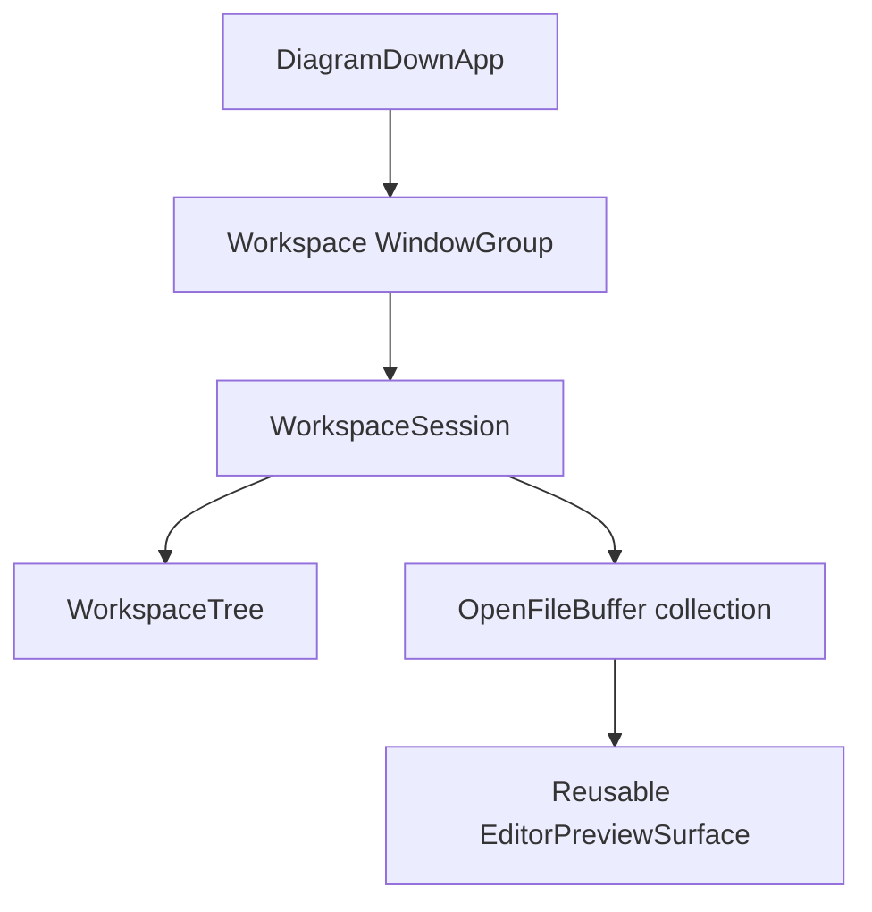

# DiagramDown folder workspace design

> Implementation status: the `0.21.0` workspace MVP is complete. For `0.22.0`,
> DiagramDown uses one folder-workspace scene exclusively; the earlier `DocumentGroup`
> compatibility path described in the historical sections below has been removed.
> Workspace tab, active-file, tree, layout, scroll, and unsaved-text recovery are also
> implemented. External-change handling, file operations, Quick Open, and search
> remain follow-up work.
>
> Sandbox-specific bookmark and entitlement discussion is historical. The current
> direct-distribution build intentionally disables App Sandbox so it can execute
> user-installed Mermaid and D2 command-line tools.

## 1. Goal

Use a folder-based workspace as DiagramDown's only application mode:

- Open or replace the current folder from **File > Open Folder…**
- Display a collapsible directory tree in a left sidebar
- Open multiple Markdown files as tabs in one workspace window
- Keep independent text, selection, scroll, undo, dirty, and preview state per file
- Save, close, and restore files without losing edits
- Reopen the most recently used folder on launch
- Show an application-owned folder welcome screen when no prior folder is available

The first implementation should feel closer to Sublime Text, Zed, and VS Code, but it should remain a Markdown editor rather than becoming a general-purpose IDE.

## 2. Previous architecture and constraint

The application originally used:

- `DocumentGroup` as the main scene
- a value-type `MarkdownDocument: FileDocument`
- one `ContentView` and one editor/preview state set per document window
- SwiftUI-managed open, save, autosave, window title, and recent-document behavior

This model works well for one file per window. It is not a good owner for a directory containing many independently editable files:

- A folder is not one Markdown document.
- Saving a `FileDocument` folder would imply replacing or serializing the whole directory.
- Each open file needs its own dirty and undo lifecycle.
- `DocumentGroup` documentation advises not to read or write document contents through its `fileURL`, because SwiftUI owns that file lifecycle.

The `0.21.0` implementation initially kept that document scene beside the workspace.
User testing showed that `DocumentGroup` still presented its own file browser at launch,
competing with folder restoration. The `0.22.0` direction therefore removes it and
uses the workspace as the sole scene.

## 3. Chosen architecture

Use one entry point:



### Workspace mode

Use a standard `WindowGroup` whose root is `WorkspaceSceneView`. On launch it resolves
the last security-scoped folder reference in the same window. **Open Folder…** obtains
a folder through `NSOpenPanel` and replaces the current window's workspace.

The workspace owns file reads and writes directly. It must not route workspace files through the existing `DocumentGroup`.

## 4. Core model

### `WorkspaceReference`

A small `Codable`, `Hashable` value used to identify and restore a workspace window:

```swift
struct WorkspaceReference: Codable, Hashable {
    let id: UUID
    let bookmarkData: Data
}
```

Do not persist only a path. A path does not restore App Sandbox authority.

### `WorkspaceSession`

An `@MainActor ObservableObject` owned by one workspace window:

```swift
@MainActor
final class WorkspaceSession: ObservableObject {
    let rootURL: URL
    @Published var rootNodes: [FileTreeNode]
    @Published var openFiles: [OpenFileBuffer]
    @Published var activeFileID: OpenFileBuffer.ID?
    @Published var sidebarVisible: Bool
}
```

Responsibilities:

- Own balanced security-scoped folder access for the window lifetime
- Load directory children lazily
- Open or activate files
- Coordinate tab selection and close confirmation
- Route Save, Save All, and Format Document to the active buffer
- Restore open tabs and the active tab
- Detect or receive external file changes

### `OpenFileBuffer`

One reference-type buffer per open file:

```swift
@MainActor
final class OpenFileBuffer: ObservableObject, Identifiable {
    let id: UUID
    let url: URL
    @Published var text: String
    @Published var savedTextFingerprint: String
    @Published var isSaving: Bool
    @Published var conflict: ExternalChangeConflict?
    var editorState: EditorState
    var previewState: PreviewState
}
```

The dirty state should be derived from a content fingerprint rather than toggled by individual edit callbacks. This makes Undo back to the saved content clear the dirty indicator correctly.

Each buffer must retain independent:

- undo history
- selection
- editor scroll position
- preview scroll position
- preview rendering revision
- view mode and preview zoom, if these become per-file rather than per-window preferences

Do not share the current editor `UndoManager` across files. Otherwise Undo after switching tabs can modify the wrong document.

### `FileTreeNode`

Use stable URLs relative to the workspace root instead of absolute-path strings as identity:

```swift
struct FileTreeNode: Identifiable, Hashable {
    let relativePath: String
    let name: String
    let kind: Kind
    var children: LoadingState<[FileTreeNode]>
}
```

Directories load only when expanded. Do not recursively enumerate the entire workspace on open.

## 5. UI structure

Use a `NavigationSplitView` or an equivalent AppKit-backed split view:

```text
┌──────────────────┬───────────────────────────────────────────────┐
│ Workspace        │ README.md  ● notes.md  diagram.md             │
│                  ├───────────────────────────────────────────────┤
│ ▾ docs           │                                               │
│   README.md       │ Editor / Editor + Preview / Preview           │
│   notes.md        │                                               │
│ ▸ examples       │                                               │
│ package.json     │                                               │
└──────────────────┴───────────────────────────────────────────────┘
```

MVP sidebar behavior:

- Directories before files, using localized standard sorting
- Expand/collapse directories
- Single-click selects; double-click or Return opens a file
- Active file is highlighted in the tree
- Open files show as tabs above the editor
- Dirty tabs show a dot
- Closing a dirty tab asks Save / Discard / Cancel
- Sidebar can be toggled from toolbar and menu

Show all regular files in the tree, but the first MVP only opens `.md` and `.markdown` files. Unsupported files remain visible and disabled. This prevents the first workspace release from silently treating arbitrary encodings or binary files as UTF-8 Markdown.

## 6. Reusing the current editor and preview

Use the extracted editor and preview surface for each workspace buffer:

```swift
struct EditorPreviewSurface: View {
    @Binding var text: String
    let fileURL: URL?
    let sessionState: EditorPreviewSessionState
}
```

Adapters:

- `WorkspaceContentView` supplies the active `OpenFileBuffer` binding.

The extraction must include the current features rather than fork them:

- editor line numbers
- formatting command
- editor/preview view modes
- Mermaid and D2 rendering
- scroll synchronization
- diagram zoom and SVG export
- PDF export
- themes and appearance

When switching tabs, the editor and preview must switch to the selected buffer's session state. A temporary `.id(buffer.id)` can prevent state leakage during the first spike, but the shipping implementation should preserve each buffer's undo and scroll state explicitly.

## 7. File access and App Sandbox

The existing `com.apple.security.files.user-selected.read-write` entitlement is sufficient for a user-selected folder. Selecting a directory through the system open panel grants recursive access to its contents.

For access after relaunch:

1. Create bookmark data with `.withSecurityScope`.
2. Persist the bookmark data in workspace restoration data or Application Support.
3. Resolve it with `.withSecurityScope`.
4. Refresh the bookmark if it is stale.
5. Call `startAccessingSecurityScopedResource()` once when opening the workspace.
6. Call `stopAccessingSecurityScopedResource()` exactly once when the workspace session closes.

Leaking unmatched security-scoped access calls can eventually prevent the process from opening more sandbox extensions. Access ownership should therefore live in one small RAII-style `SecurityScopedAccess` object rather than being scattered across tree and buffer code.

Security rules:

- Never recursively follow directory symlinks.
- Resolve and verify a candidate URL is within the selected root before read or write.
- Do not use string prefix checks such as `path.hasPrefix(root.path)`; compare standardized path components.
- Treat packages as files by default.
- Apply a maximum editable file size, initially 4 MB to match formatting limits.
- Reject invalid UTF-8 without modifying the file.
- Use coordinated, atomic writes where possible.

## 8. Saving and external changes

Workspace files are not `FileDocument` values, so the workspace needs an explicit save pipeline.

### Save

- `Command-S` saves the active buffer.
- Save All is added after the basic active-file path works.
- Encode UTF-8 using `MarkdownFileCodec`.
- Write atomically to a sibling temporary file and replace the destination.
- Update the saved fingerprint only after the replacement succeeds.
- Keep the buffer dirty and show an error if saving fails.

The first version should use explicit saving. A later setting can add autosave after conflict handling is reliable.

### External changes

Record modification date, file resource identifier, and a content fingerprint when loading and saving.

- If a clean buffer changes on disk, reload it and preserve a reasonable selection.
- If a dirty buffer changes on disk, do not overwrite either version. Show Keep Editor / Reload from Disk / Save As.
- If a file is deleted, keep the dirty buffer open and offer Save As.
- Directory watchers are an optimization; revalidate on tab activation and before save even when watching is enabled.

## 9. Directory tree performance

Use a dedicated actor for file-system work:

```swift
actor WorkspaceFileService {
    func children(of directory: URL, root: URL) async throws -> [FileTreeNode]
    func load(_ file: URL, root: URL) async throws -> LoadedFile
    func save(_ text: String, to file: URL, root: URL) async throws -> SavedFile
}
```

Rules:

- Enumerate only one expanded directory level at a time.
- Request only needed URL resource keys.
- Never block the main actor with `contentsOfDirectory` or file reads.
- Cancel obsolete expansion and load tasks.
- Cache loaded directory children and invalidate only affected directories.
- Start with `DispatchSource` directory observation; evaluate FSEvents only if real workspaces expose scaling problems.

## 10. Alternatives considered

| Approach | Result | Reason |
| --- | --- | --- |
| Treat a folder as one `FileDocument` | Reject | Incorrect save semantics and one dirty state for many files |
| Open every tree file in a separate `DocumentGroup` window | Reject for workspace tabs | Does not produce one IDE-like workspace window |
| Replace `DocumentGroup` completely with `WindowGroup` | Choose for 0.22.0 | Gives startup and restoration one unambiguous folder-workspace lifecycle |
| Keep `DocumentGroup` and add a workspace `WindowGroup` | Superseded after 0.21.0 | The document browser competed with automatic workspace restoration |
| Use recursive eager enumeration | Reject | Slow and memory-heavy for large folders |
| Use one shared text view and undo manager for all tabs | Reject | Cross-file undo and state leakage risk |

## 11. Proposed implementation sequence

### 0.21.0 — workspace MVP (implemented)

1. Extract `EditorPreviewSurface` for reuse by workspace buffers.
2. Add `WorkspaceReference`, security-scoped bookmark handling, and workspace `WindowGroup`.
3. Add **Open Folder…** and create one workspace window.
4. Implement lazy, read-only directory tree browsing.
5. Add `OpenFileBuffer` collection and a native tab strip.
6. Open multiple Markdown files and switch between them safely.
7. Implement active-file Save and dirty-tab close confirmation.
8. Add unit tests for tree filtering, root containment, bookmark lifecycle abstraction, dirty state, tab switching, and atomic saving.

MVP exclusions:

- no file creation, rename, move, or delete from the sidebar
- no full-text search
- no split editor groups
- no arbitrary text/binary editing
- no Git status decorations
- no automatic save
- no drag-and-drop reordering

### 0.22.0 — restoration (implemented)

- Restore workspace windows through the codable security-scoped folder reference
- Explicitly reopen the most recently used workspace at launch instead of depending
  only on macOS window restoration preferences
- Persist open tabs, tab order, active file, sidebar state, expanded directories,
  per-tab layout and editor scroll position
- Persist both clean content and unsaved edits in atomic Application Support snapshots
- Save All

Recovery snapshots contain document text and therefore remain inside DiagramDown's
sandboxed Application Support container. They are updated after a short debounce and
flushed when the workspace view disappears. Paths are stored relative to the authorized
workspace root and rejected if they contain traversal components.

### 0.23.0 — workspace reliability and file operations (planned)

- External file change and deletion handling
- Directory change observation
- File creation, rename, and delete with confirmation
- Sidebar reveal and refresh commands

### 0.24.0 — workspace productivity (planned)

- Quick Open
- Workspace text search
- Optional broader UTF-8 text-file editing with Markdown preview disabled
- Split editor groups
- Git ignore-aware tree filtering and optional source-control decorations

## 12. MVP acceptance criteria

- Startup never presents the system single-file document browser.
- A user can select a folder and see its first directory level without recursive scanning.
- Expanding a directory loads its children asynchronously.
- At least ten Markdown files can be opened as tabs in one workspace window.
- Each tab retains its own text, dirty indicator, selection, scroll position, and undo history.
- Switching tabs never writes a file or loses unsaved text.
- `Command-S` saves only the active file atomically.
- Closing a dirty tab or workspace window cannot discard changes without confirmation.
- Symlink traversal cannot escape the selected workspace root.
- Folder access works under the existing App Sandbox entitlement.
- No network access or new executable entitlement is introduced.

## 13. Recommended next step

The implemented sequence started with editor-surface extraction and an in-memory
workspace model test. The `0.22.0` follow-up removes the remaining single-file scene
after workspace restoration and multi-buffer lifecycle tests are in place.

After that foundation passes existing tests, add the folder picker and lazy tree as a vertical slice: open folder → expand tree → open two files → edit both → switch tabs → save one → close with confirmation.

## References

- [Apple: DocumentGroup](https://developer.apple.com/documentation/swiftui/documentgroup)
- [Apple: WindowGroup](https://developer.apple.com/documentation/swiftui/windowgroup)
- [Apple: Accessing files from the macOS App Sandbox](https://developer.apple.com/documentation/security/accessing-files-from-the-macos-app-sandbox)
- [Apple: startAccessingSecurityScopedResource](https://developer.apple.com/documentation/foundation/url/startaccessingsecurityscopedresource())
